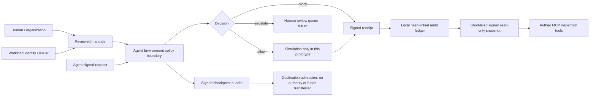

# From the vision to a product architecture

Goal: give an agent a bounded, inspectable way to represent who authorized its work,
what it may attempt, what it simulated, and which checkpoint can cross environments.

## What belongs where

| Vision element | MCP's job | Agent Environment / external systems |
| --- | --- | --- |
| Verifiable identity / passport | Inspect a pinned issuer's identity assertion | Enroll owners, attest workloads, bind agent keys, rotate/revoke credentials |
| Digital mandate | Show scope, resources, expiry and issuer | Human/operator creates and signs an explicit mandate; an LLM draft cannot authorize itself |
| Delegated authority | Explain/inspect policy; return no execution grant | Evaluate actor, scope, resource, expiry, revocation and policy version at an execution boundary |
| Programmable money | Inspect budget and receipt summaries | Isolated wallet/signer, atomic reservation, transfer submission and settlement reconciliation |
| Continuous assurance | Expose signed, fresh summaries | Verify every request, record evidence, export tamper-evident events, externally witness log heads |
| Environment transition | Inspect handoff-related receipts | Admit a signed checkpoint, reauthenticate, attenuate scope, obtain a fresh destination mandate |
| Natural-language goal | Provide capability documentation | Intent compiler drafts a structured mandate for human review; it cannot create consent |
| Agent-to-agent work | Future discovery/read adapters | A2A-style task lifecycle, mutually authenticated channels and narrow task delegation |

## Implemented vertical slice

- Owner/agent relationship is **asserted by a locally configured issuer**.
- Requests demonstrate possession of the agent key bound in the signed passport.
- Exact resource IDs and enumerated actions; no wildcard grant expansion.
- Integer DEMO minor units; no floating-point money or implicit asset conversions.
- Per-action, cumulative, and human-review thresholds.
- SQLite `BEGIN IMMEDIATE` serializes simulated budget reservations; idempotency
  keys cannot be reused for a different request.
- Passport and mandate revocation records are checked locally for new requests.
- Receipts are Ed25519-signed JWS documents chained by SHA-256. Signatures attest
  what the configured issuer recorded, not that a real external action happened.
- Destination-bound, short-lived checkpoint envelopes; duplicate import rejected.
- Scope intersection is required, and no source funds or mandate are made active
  at the destination. The checkpoint carries IDs, a constrained status, and a
  content digest—not files, transcripts, prompts, tokens or key material.
- MCP pins issuer, key ID, public key, agent, environment and audience. It rejects
  expiry, signature failure, type confusion, unexpected fields and inconsistent
  demo-budget summaries.

## Why two projects

MCP is a tool/context protocol. It is not the right place to implement key custody,
owner enrollment, financial authorization, runtime isolation or migration of a
running process. An MCP server should never treat an agent's requested scope or
natural-language instruction as proof that a human delegated that authority.

The read bridge intentionally does not forward OAuth tokens, expose the private
signer, or make new network requests. Future HTTP transport must follow MCP's own
authorization rules and audience separation; a signed report is not an OAuth token.

## Environment transitions: what this actually means

`research → review` moves a **verifiable checkpoint reference**. It does not move
a process, memory image, signing key, credentials, a live session, or spendable
balance. Source suspension, destination workload attestation, credential exchange,
secret injection, source revocation synchronization and exactly-once resumption
are later runtime-adapter work. A successful checkpoint import is not permission
to resume execution.
